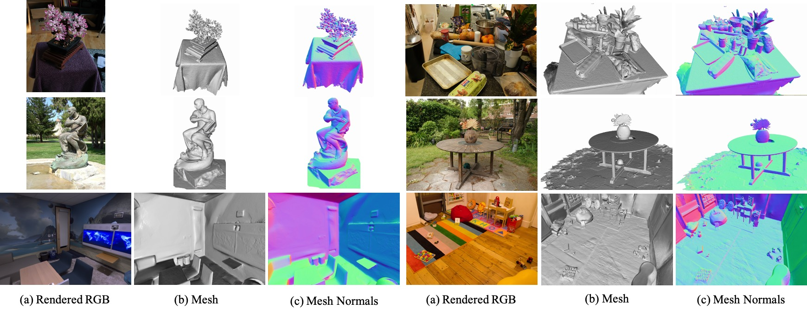

# PGSR: Planar-based Gaussian Splatting for Efficient and High-Fidelity Surface Reconstruction
Danpeng Chen, Hai Li, [Weicai Ye](https://ywcmaike.github.io/), Yifan Wang, Weijian Xie, Shangjin Zhai, Nan Wang, Haomin Liu, Hujun Bao, [Guofeng Zhang](http://www.cad.zju.edu.cn/home/gfzhang/)
### [Project Page](https://zju3dv.github.io/pgsr/) | [arXiv](https://arxiv.org/abs/2406.06521)


We present a Planar-based Gaussian Splatting Reconstruction representation for efficient and high-fidelity surface reconstruction from multi-view RGB images without any geometric prior (depth or normal from pre-trained model).  

## Updates
- [2024.07.18]: We fine-tuned the hyperparameters based on the original paper. The Chamfer Distance on the DTU dataset decreased to 0.47.

The Chamfer Distance↓ on the DTU dataset
|     | 24| 37| 40| 55| 63| 65| 69| 83| 97|105|106|110|114|118|122|Mean|Time|
|-------|---|---|---|---|---|---|---|---|---|---|---|---|---|---|---|---|---|
|PGSR(Paper)|0.34|0.58|0.29|0.29|0.78|0.58|0.54|1.01|0.73|0.51|0.49|0.69|0.31|0.37|0.38|0.53|0.6h|
|PGSR(Code_V1.0)|0.33|0.51|0.29|0.28|0.75|0.53|0.46|0.92|0.62|0.48|0.45|0.55|0.29|0.33|0.31|0.47|0.5h|
|PGSR(Remove ICP)|0.36|0.57|0.38|0.33|0.78|0.58|0.50|1.08|0.63|0.59|0.46|0.54|0.30|0.38|0.34|0.52|0.5h|

The F1 Score↑ on the TnT dataset
||PGSR(Paper)|PGSR(Code_V1.0)
|-|-|-|
|Barn|0.66|0.65
|Caterpillar|0.41|0.44
|Courthouse|0.21|0.20
|Ignatius|0.80|0.81
|Meetingroom|0.29|0.32
|Truck|0.60|0.66
|Mean|0.50|0.51
|Time|1.2h|45m

## Installation

The repository contains submodules, thus please check it out with 
```shell
# SSH
git clone git@github.com:zju3dv/PGSR.git
cd PGSR

conda create -n pgsr python=3.8
conda activate pgsr

pip install torch torchvision torchaudio --index-url https://download.pytorch.org/whl/cu118 #replace your cuda version
pip install -r requirements.txt
pip install submodules/diff-plane-rasterization
pip install submodules/simple-knn
```

## Dataset Preprocess
Please download the preprocessed DTU dataset from [2DGS](https://surfsplatting.github.io/), the Tanks and Temples dataset from [official webiste](https://www.tanksandtemples.org/download/), the Mip-NeRF 360 dataset from the [official webiste](https://jonbarron.info/mipnerf360/). You need to download the ground truth point clouds from the [DTU dataset](https://roboimagedata.compute.dtu.dk/?page_id=36). For the Tanks and Temples dataset, you need to download the reconstruction, alignment and cropfiles from the [official webiste](https://jonbarron.info/mipnerf360/). 

The data folder should like this:
```shell
data
├── dtu_dataset
│   ├── dtu
│   │   ├── scan24
│   │   │   ├── images
│   │   │   ├── mask
│   │   │   ├── sparse
│   │   │   ├── cameras_sphere.npz
│   │   │   └── cameras.npz
│   │   └── ...
│   ├── dtu_eval
│   │   ├── Points
│   │   │   └── stl
│   │   └── ObsMask
├── tnt_dataset
│   ├── tnt
│   │   ├── Ignatius
│   │   │   ├── images_raw
│   │   │   ├── Ignatius_COLMAP_SfM.log
│   │   │   ├── Ignatius_trans.txt
│   │   │   ├── Ignatius.json
│   │   │   ├── Ignatius_mapping_reference.txt
│   │   │   └── Ignatius.ply
│   │   └── ...
└── MipNeRF360
    ├── bicycle
    └── ...
```

Then run the scripts to preprocess Tanks and Temples dataset:
```shell
# Install COLMAP
Refer to https://colmap.github.io/install.html

# Tanks and Temples dataset
python scripts/preprocess/convert_tnt.py --tnt_path your_tnt_path
```

## Training and Evaluation
```shell
# Fill in the relevant parameters in the script, then run it.

# DTU dataset
python scripts/run_dtu.py

# Tanks and Temples dataset
python scripts/run_tnt.py

# Mip360 dataset
python scripts/run_mip360.py
```

## Custom Dataset
The data folder should like this:
```shell
data
├── data_name1
│   └── input
│       ├── *.jpg/*.png
│       └── ...
├── data_name2
└── ...
```
Then run the following script to preprocess the dataset and to train and test:
```shell
# Preprocess dataset
python scripts/preprocess/convert.py --data_path your_data_path
```

#### Some Suggestions:
- Adjust the threshold for selecting the nearest frame in ModelParams based on the dataset;
- -r n: Downsample the images by a factor of n to accelerate the training speed;
- --max_abs_split_points 0: For weakly textured scenes, to prevent overfitting in areas with weak textures, we recommend disabling this splitting strategy by setting it to 0;
- --opacity_cull_threshold 0.05: To reduce the number of Gaussian point clouds in a simple way, you can set this threshold.
```shell
# Training
python train.py -s data_path -m out_path --max_abs_split_points 0 --opacity_cull_threshold 0.05
```

#### Some Suggestions:
- Adjust max_depth and voxel_size based on the dataset;
- --use_depth_filter: Enable depth filtering to remove potentially inaccurate depth points using single-view and multi-view techniques. For scenes with floating points or insufficient viewpoints, it is recommended to turn this on.
```shell
# Rendering and Extract Mesh
python render.py -m out_path --max_depth 10.0 --voxel_size 0.01
```

## Acknowledgements
This project is built upon [3DGS](https://github.com/graphdeco-inria/gaussian-splatting). Densify is based on [AbsGau](https://surfsplatting.github.io/) and [GOF](https://github.com/autonomousvision/gaussian-opacity-fields?tab=readme-ov-file). DTU and Tanks and Temples dataset preprocess are based on [Neuralangelo scripts](https://github.com/NVlabs/neuralangelo/blob/main/DATA_PROCESSING.md). Evaluation scripts for DTU and Tanks and Temples dataset are based on [DTUeval-python](https://github.com/jzhangbs/DTUeval-python) and [TanksAndTemples](https://github.com/isl-org/TanksAndTemples/tree/master/python_toolbox/evaluation) respectively. We thank all the authors for their great work and repos. 


## Citation

If you find this code useful for your research, please use the following BibTeX entry.

```bibtex
@article{chen2024pgsr,
  title={PGSR: Planar-based Gaussian Splatting for Efficient and High-Fidelity Surface Reconstruction},
  author={Chen, Danpeng and Li, Hai and Ye, Weicai and Wang, Yifan and Xie, Weijian and Zhai, Shangjin and Wang, Nan and Liu, Haomin and Bao, Hujun and Zhang, Guofeng},
  journal={arXiv preprint arXiv:2406.06521},
  year={2024}
}
```
