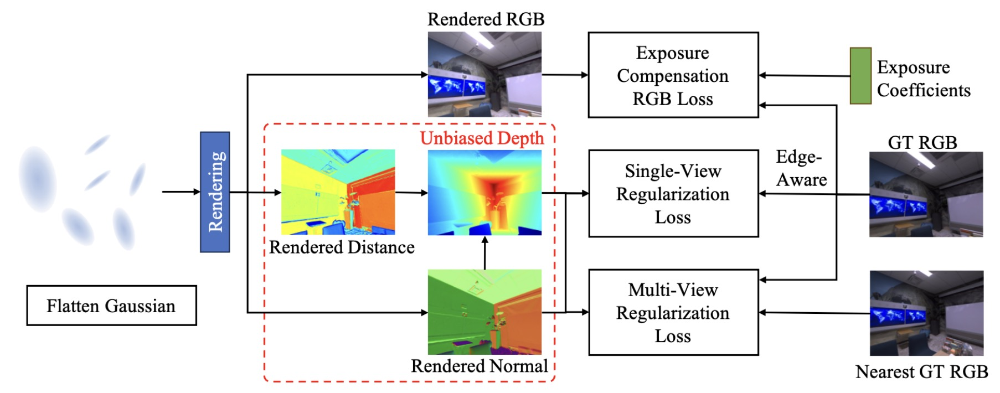
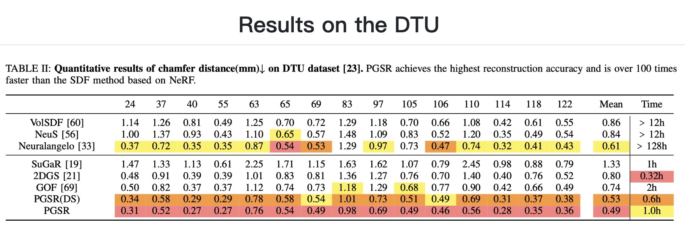
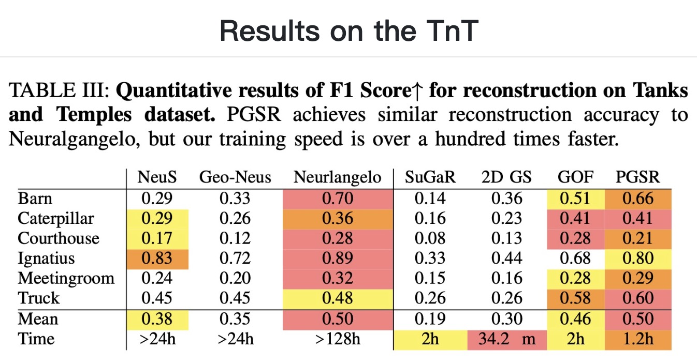

# PGSR: Planar-based Gaussian Splatting for Efficient and High-Fidelity Surface Reconstruction
### [Project Page](https://zju3dv.github.io/pgsr/) | [Paper]()
<!-- Code is coming soon. -->

<br/>

> PGSR: Planar-based Gaussian Splatting for Efficient and High-Fidelity Surface Reconstruction

> Danpeng Chen, Hai Li, [Weicai Ye](https://ywcmaike.github.io/), Yifan Wang, Weijian Xie, Shangjin Zhai, Nan Wang, Haomin Liu, Hujun Bao, [Guofeng Zhang](http://www.cad.zju.edu.cn/home/gfzhang/)

## Framework


## Quantitative Results



## Qualitative Results


## Brewing🍺, code coming soon.
## Citation

If you find this code useful for your research, please use the following BibTeX entry.

```bibtex
@article{chen2024pgsr,
  title={PGSR: Planar-based Gaussian Splatting for Efficient and High-Fidelity Surface Reconstruction},
  author={Danpeng Chen and Hai Li and Weicai Ye and Yifan Wang and Weijian Xie and Shangjin Zhai and Nan Wang and Haomin Liu and Hujun Bao and Guofeng Zhang},
    booktitle={arxiv preprint arxiv:2406.06521}, 
    year={2024}
}
```